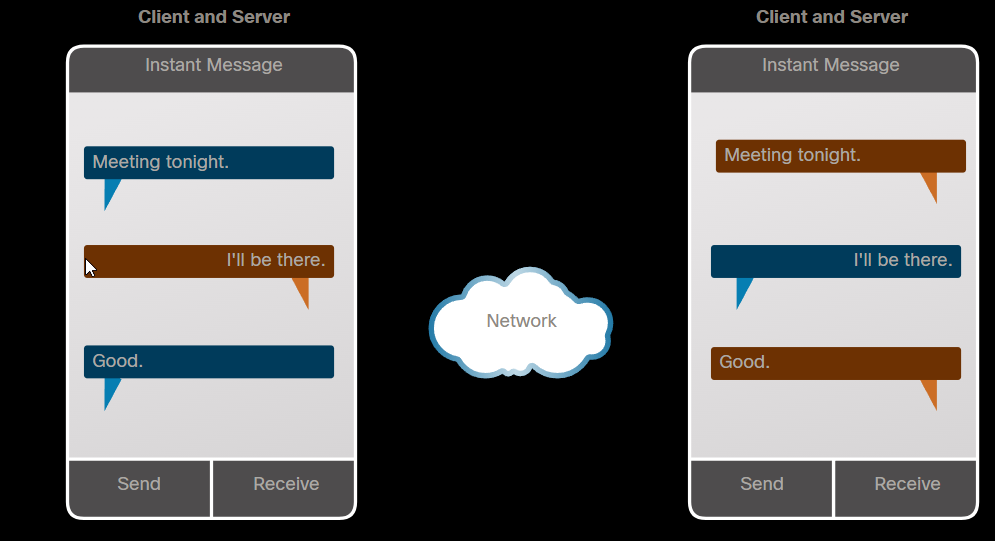

## 2.1.1 Video - İstemciler Ve Sunucular : 
Bu video link izle: 

## 2.1.2 İstemci ve Sunucu (Client ve Server) Görevleri : 
Her bilgisayar ağa bağlanır ve ağ iletişimine bir cihaz olarak direkt katılır. Cihazlar mesaj gönderebilir yada ağ üzerinden mesaj alabilir. Modern ağlarda, bilgisayar cihazları bir istemci, sunucu yada hem istemci hem sunucu şeklinde davranabilir. Bilgisayara yüklenmiş yazılım bilgisayarın sunucu mu, istemci mi yoksa her ikisi şeklinde mi olduğunu belirler. Sunucularda ağdaki diğer cihazlara servisler sağlayan(e-mail gibi, web sunucusu gibi) yazılımlar yüklü cihazlardır. Her servis ayrı sunucu yazılımı gerektirir. Örneğin, bir web servisi sağlamak isteyen bir cihaz için bir web sunucu yazılımı gerekir. İnternette gezindiğiniz her web sayfası,  herhanggi  bir ağda global internete bağlanmış bir sunucu sayesinde gelir.
İstemciler, sunuculardan veri çekip göstermek için yazılımların kurulduğu cihazlardır. Örneğin bir istemci yazılımına örnek olarak web tarayıcıları(Internet Explorer, Safari, Chrome)
> Cihaz derken burada İngilizce'deki host kavramı anlatılmaya çalışılmıştır.
<table>
<tr>
<th>Tür</th>
<th>Açıklama</th>
</tr>
<tr>
<td>
E-posta</td>
<td>
E-posta sunucuları eposta sunucu yazılımı çalıştırır. İstemciler, bu eposta sunucularına erişmek için  eposta istemci yazılımları kullanır. (Microsoft Outlook gibi)
</td>
</tr>
<tr>
<td>
Web</td>
<td>
Web sunucuları web sunucu yazılımları çalıştırır. İstemciler, bu web sunucularına erişmek için web tarayıcıları kullanır. (Chrome gibi)
</td>
</tr>
<tr>
<td>
Dosya</td>
<td>
Dosya sunucuları,  şirketlerin ve kullanıcıların dosyalarını santral lokasyonlarda saklar. İstemci cihazları, Windows Dosya Gezgini gibi yazılımları
kullanarak bu dosyalara erişebilir.</td>
</tr>

</table>

## 2.1.3 Eşler arası Ağ (Peer to Peer Networks - P2P) :
İstemci ve sunucu yazılımları genelde farklı bilgisayarlarda çalışır fakat bir bilgisayarın hem istemci hem sunucu yazılımı çalıştırmasıda mümkündür. Küçük işyerlerinde ve evlerde, çoğu bilgisayar ağda hem istemci hem sunucu olarak görev yapar. Bu tür ağ tipine eşler arası ağ (peer to peer networks) denir.
En basit P2P ağ örneği iki bilgisayarın birbirine direkt olarak kablolu ya da kablosuz olarak bağlanmasıdır. Bu her iki bilgisayar bu ağı kullanarak birbirleriyle istemci veya sunucu gibi davranarak veri ve hizmet alış-verişi yapabilir. Birden çok bilgisayarlar ayrıca ağa bağlanarak büyük bir P2P ağı yaratabilir fakat bu kadar bilgisayarın birbirine bağlı olması için switch gibi bir cihaz gerekir. P2P ağının en büyük dezavantajı ağa bağlı bir cihazın aynı zamanda hem istemci hem sunucu şeklinde çalışması durumunda cihazın performansının düşmesidir.
Büyük işyerlerinde, yüksek miktarda ağ trafiği potansiyeli olması nedeniyle, gelen servis isteklerini yerine getirmek amacıyla sıklıkla özelleştirilmiş sunucular gerekir.
### P2P ağının avantajları : 
* Kurulması kolaydır.
* Daha az karmaşıktır. 
* Sadece varolan bilgisayarlarla kullanılabildiği ve özelleştirilmiş sunucular gerektirmediği için daha az maliyetlidir.
* Dosya transferi veya yazıcı paylaşımı gibi basit görevler için kullanılır.
### P2P ağının dezavantajları :
* Merkezi bir yönetim yoktur.
* Güvenli değildir. 
* Her cihaz hem sunucu hem istemci şeklinde davranacağı için performansı düşürür.

## 2.1.4 Eşler arası Uygulamalar : 
Bir P2P uygulaması resimde gösterildiği gibi bir iletişimde hem sunucu hem de istemci gibi hareket eder. Bu modelde her istemci bir sunucu ve her sunucu bir istemcidir. P2P uygulamaları her cihazın bir kullanıcı arayüzü sağlamasını ve bir background servisi çalıştırmasını gerektirir.
   
Bazı P2P uygulamaları kaynak paylaşımının merkezi olmadığı hibrit sistemler kullanır fakat kaynak konumlarına işaret eden dizinler merkezi bir dizinde tutulur. Hibrit sistemlerde her eş  başka bir eş cihazdaki saklanmış verinin/kaynağın konumunu alan bir dizin sunucusuna erişir.

> Resimde de gösterildiği üzere iki kullanıcı da hem mesaj gönderiyor(istemci rolü) hem mesaj alıyor(sunucu rolü).

## 2.1.5 Ağdaki Çoklu Roller (Multiple Roles in Network) :
Resimde aynı zamanda bir ya da daha fazla istemciye sunucu yazılımıyla servis sağlayan bir bilgisayar gösterilmiştir. Ek olarak, bir bilgisayar çeşitli türlerde sunucu yazılımı çalıştırabilir. Evlerde ya da küçük işletmelerde, bir bilgisayarın hem dosya sunucusu hem web sunucu hem de eposta sunucusu çalıştırması gereklidir. 
Ayrıca bir bilgisayar birden fazla istemci yazılımı çalıştırabilir. Burada her servis için bir istemci yazılımı olması gereklidir. Bir çok istemci yazılımının yüklendiği bir cihaz, aynı anda birden fazla sunucuya bağlanabilir. Örneğin bir kullanıcı bir yandan mesajlaşıp internet radyosunu dinlerken bir yandanda epostalarını kontrol edip bir internet sitesinde gezebilir. 

