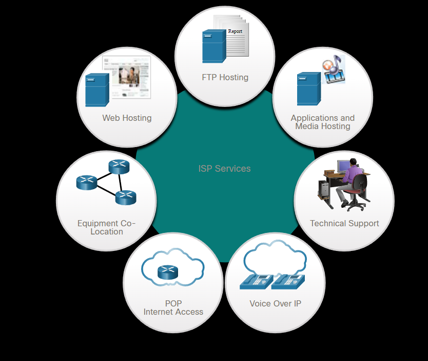
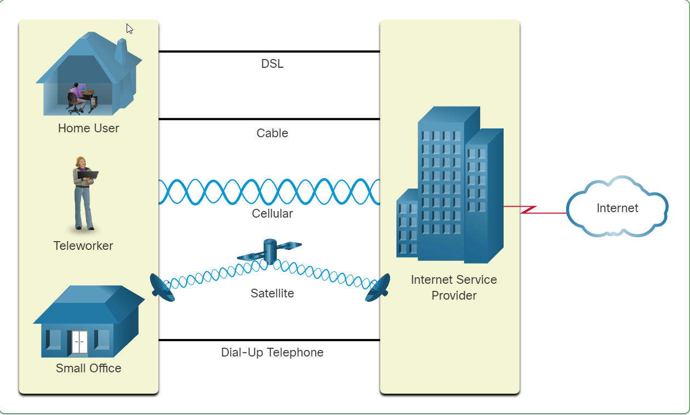

## İnternet Servis Sağlayıcıları (ISS) : 
ISP(Internet Service Provider) yani İnternet Servis Sağlayıcısı(ISS) internet ile ev ağı arasında köprü kurar. ISS, bir yerel kablo sağlayıcısı, sabit telefon hattı sağlayıcısı, telefonlarınız için hücresel ağ sağlayıcısı ya da herhangi bir şirketin fiziksel ağ altyapısındaki bant-genişliğini kiralayıp sağlayan bağımsız bir şirket olabilir. Bir çok ISS servisi abonelerine figürde gösterildiği gibi bir çok ek teklifler sunar. Bu servisler genelde eposta hesapları, ağ deposu, web hosting ve otomatik yedek veya güvenlik servisleridir.
ISS'ler küresel internetteki iletişim için çok kritiktir. Her ISS servisi, tüm dünyadaki internete bağlanmış kullanıcıların bulunduğu bir ağ yaratmak için  diğer ISS servisine bağlıdır. ISS servisleri, internet trafiğinin kaynaktan hedefe en kısa yolda gitmesi için belirli bir hiyerarşik bir düzende bağlanmıştır. 
İnternetin belkemiği, dünyanın dört bucağındaki büyük metropollerin çeşitli servis sağlayıcı ağlarını birbirine bağlamak için yüksek hızlı veri bağlantıları sağlayan bir bilgi otoyolu gibidir. Kısaca internet, dünyanın büyük ISS servislerini bağlayıp burada herhangi bir ISS servisindeki kullanıcının diğer herhangi bir ISS servisindeki kullanıcıyla veri aktarımı ve iletişim kurmasını sağlayan bir yoldur. Bu bağlantının olmasını sağlayan ağ ortamı fiber optik kablolardır. Bu kablolar genelde yeraltında şehirlerle kıtalara bağlı şekildedir. Ayrıca fiber optik kablolar, deniz altında kıtalara,ülkelere ve şehirlere bağlı şekilde çalışabilir. 

## ISS Bağlantıları : 
İnternetin belkemiğini oluşturan ISS'lerin ara bağlantısı, kaynak ve hedef arasındaki bilgi akışını yönlendiren pahalı router ve switchlere sahip karmaşık bir fiber optik ağıdır. Ortalama bir ev kullanıcısının, dışardaki ev ağının altyapısı hakkında bir fikri yoktur. Bir ev kullanıcısı için, ISS'e bağlanmak hiç karmaşık olmayan bir süreçtir.
Resmin en üstünde, bilgisayardan direkt olarak modem aracılığyla ISS'e bağlanan basit bir ISS bağlantısı gösterilmiştir. Bu seçenek genelde kullanılmaz çünkü bu şekilde bilgisayırınız internette çok güvensiz olur.
Resmin en altında daha güvenli bir bağlantı seçeneği gösterilmiştir. Belirli bir LAN ağındaki bilgisayarlar bir routera bağlanarak oradan modeme oradanda ISS'e bağlanıyor. Bu şekilde internette gezen bilgisayarlar hem daha güvenli hemde daha sağlıklı bir yöntem izlenmiştir. Ayrıca bu şekilde kablosuz şekilde routera bağlanarak internete erişme şansı olur. Routerlar ayrıca LAN'daki her cihaz için IP adresi bilgileri ve güvenlik sağlar.

## Kablolar ve DSL Bağlantısı : 
Bir çok ev kullanıcısı, İnternet servis sağlayıcısına bağlanmak için fiber-optik kullanmıyor. Resimde küçük ofislerde ve işletmelerde sıklıkla kullanılan bağlantı türleri gösterilmiştir. Genelde en çok iki tanesi kullanılır : 
* **Kablo :** Genelde televizyon servis sağlayıcıları tarafından sağlanır. İnternet sinyalleri, televizyon sinyallerinide alan eşeksenli kablo tarafından alınır. Bu yüksek bantgenişliği ve her zaman erişimi olan bir internet bağlanıtısı sunar. Özel bir modem kablosu, kablodaki internet sinyallerini kablodaki diğer sinyallerden ayırır ve bir bilgisayar veya LAN için ethernet bağlantısı sağlar.
* **DSL (Digital Subscriber Line : Dijital Abone Hattı):** Dijital Abone Hattı; yüksek bantgenişliği ve her zaman erişimi olan bir internet sunar. DSL'in Ethernet bağlantısı sağlamak için DSL sinyalini telefon sinyalinden ayıran yüksek hıza sahip olan özel bir modem gerektirir. DSL, hattın üç farklı kanala ayrıldığı telefon hattında çalışır. İlk hat, sesli telefon aramaları için kullanılır. Bu kanal internete bağlanmadan kişisel telefon çağrıları alma olanağı sunar. İkinci kanal, internetten veri çekmek için kullanılan hızlı indirme kanalıdır. Üçüncü kanal ise veri göndermek veya yüklemek için kullanılan bir kanaldır. Bu kanal genelde ikinci kanala göre daha yavaştır. DSL bağlantınızın kalitesi, bağlı olduğunuz telefon hattının ve telefon şirketinizin santral merkezine olan uzaklığınıza göre değişir. Santral merkezinize ne kadar uzaksanız, DSL bağlantısının kalitesi o kadar düşük ne kadar yakınsanız o kadar yüksek olur. 

